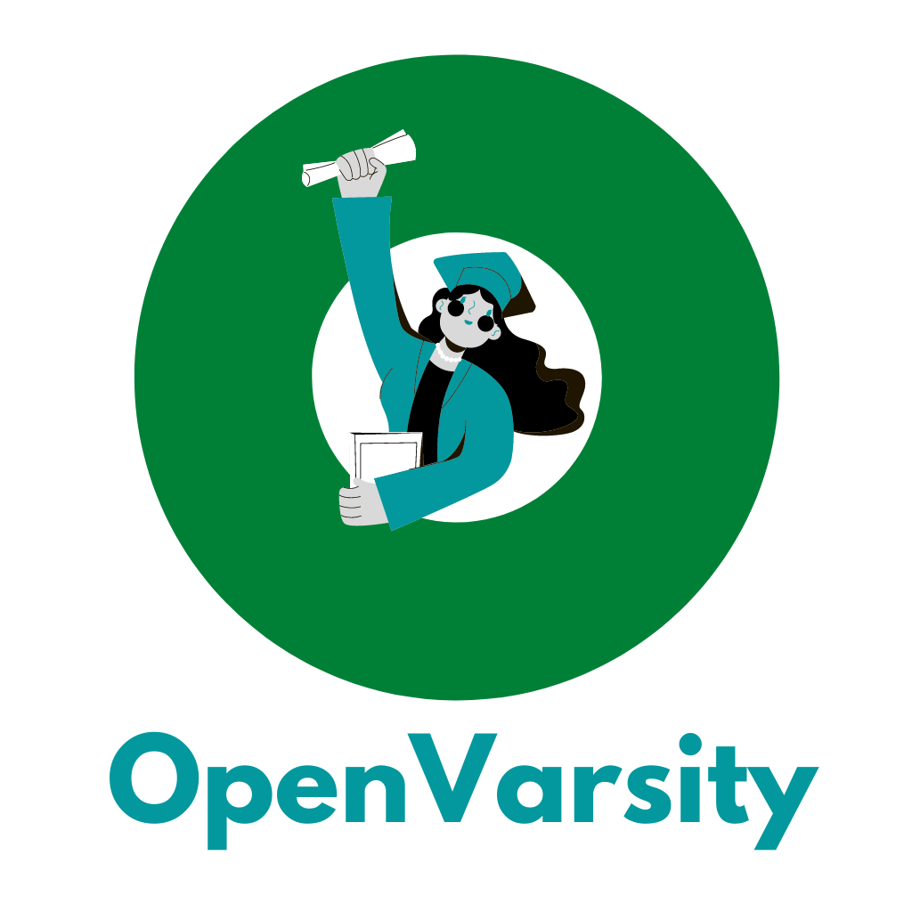

OpenVarsity Backend (0.0.1-alpha01)
---

#### NOTE: This is strictly a personal project with business use-cases. Copying or redestribution of code in any form or manner possible without a written approval from the owner is prohibited. Kindly do not feel entitled to contribute, fork or raise a pull request, in any manner possible without a prior written approval from the owner. Read the license file carefully.

### Online MOOC System.

* Server side codebase
* Rest API servive where an **instructor
  and student manage their Webinars & Courses**.
* A Creator can create **_course_**, **_subjects_**, **_tags_** and they can upload videos and webinars to the system.
* **_Lessons & webinars can be present in multiple courses and subjects._**
* A **_Student can_** then **_search for webinars and/or videos_** using **_webinar title, video title, course name and subject name_**,
    * and can filter using **_course, subjects and tags_**.

**User Stories**
* As an instructor, I can upload a webinar.
* As an instructor, I can create, edit, delete course.
* As an instructor, I can create, edit, delete subjects.
* As an instructor, I can create, edit, delete tags.
* As an instructor, I can upload a video.
* As an instructor, I can add new tag while uploading video or webinar.
* As an instructor, I can see the most viewed videos, courses and webinars.
* As a student, I can see list of webinars & videos.
* As a student, I can search webinars & videos by title.
* As a student, I can filter webinars & videos by course, subjects, tags.
* As a student, when I am playing a video or a webinar, I can get personalized suggestions of courses/webinars.

